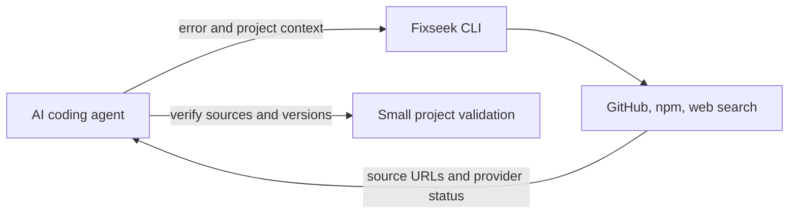

# Fixseek

Find existing fixes, tools, GitHub issues, packages, and workarounds before you build from scratch.

[中文文档](./README.zh-CN.md)

## Why Fixseek?

When developers hit an error, integration problem, CLI failure, dependency issue,
or tooling gap, the first instinct is often to ask AI or debug from zero.
Fixseek takes a different first step: search for signs that someone has already
solved it.

It turns an error log or problem description into ranked candidates: existing
GitHub projects, GitHub issues, npm packages, workarounds, docs, and related
tools. You still review the result; Fixseek helps you avoid missing the obvious
existing fix before you build one yourself.

### Built for AI coding agents

An agent can call `fixseek --json` before choosing a dependency or writing a
workaround. The response includes the generated queries, source URLs, ranked
candidates, risk warnings, and a status for each provider. The agent can then
open the original sources, compare versions with the current repository, and
validate a proposed change. Fixseek does not ask an AI model to invent sources
or execute commands found in search results.

```bash
fixseek --json --stack "Vite,Node.js" "module not found after pnpm install"
```

`complete`, `partial`, `empty`, `skipped`, and `failed` remain distinct in JSON.
For example, `partial` keeps results from successful queries while showing that
other queries failed. The agent JSON envelope is schema version `1.3`. See the [Codex skill](skills/fixseek/SKILL.md) for a
reusable agent workflow.



## Installation

```bash
npm install -g fixseek
```

The npm registry currently serves the stable 0.1.0 release. The 0.4.0 beta
changes in this repository can be built locally with `npm install && npm run build`.

## Quick Start

```bash
fixseek "Claude Code DeepSeek reasoning_content error"

cat error.log | fixseek --stdin

fixseek --stack "Node.js,Docker" "container networking issue"
```

CLI searches real providers by default. npm needs only outbound network access;
GitHub and web are used when their credentials are configured. `--mock` is only
for deterministic tests and demos.

When the calling environment cannot reach the host VPN/TUN network, use the
host-only gateway described in
[`docs/FIXSEEK_HOST_GATEWAY.md`](docs/FIXSEEK_HOST_GATEWAY.md) if a host-side
connector can reach it. Check `/health` and request authorization before
starting a persistent loopback listener; reuse a healthy listener afterward.

## Usage

```bash
# Direct query
fixseek "reasoning_content error with Claude Code + DeepSeek"

# Read a log from stdin
cat error.log | fixseek --stdin

# Real search across configured providers (the default)
fixseek "vite module not found"

# Real npm search (no token required; network access is required)
fixseek --provider npm "ESM CommonJS package error"

# Real GitHub search (requires GITHUB_TOKEN)
fixseek --provider github "vite module not found"

# Real web search (requires WEB_SEARCH_API_KEY)
fixseek --provider web "vite module not found"

# Stable machine-readable output for coding agents
fixseek --json --stack "Vite,Node.js" \
  --constraints "no dependency upgrade" "vite module not found"

# Optional Jev reranking and a short agent handoff
fixseek --json --reranker jev "vite module not found after pnpm install"

# Local, open-source Laya reranking (start the loopback service first)
fixseek --json --reranker laya "vite module not found after pnpm install"

# Chinese output
fixseek --lang zh "reasoning_content 报错"

# Limit results
fixseek --max-results 5 "npm package ESM CommonJS error"
```

Supported providers are `github`, `web`, and `npm`. GitHub searches require
`GITHUB_TOKEN`, web searches require `WEB_SEARCH_API_KEY`, and npm searches do
not require a token. The default mode attempts every provider and preserves
each provider's `complete`, `partial`, `empty`, `skipped`, or `failed` state. `--real`
remains accepted as an explicit compatibility flag.

### Optional model-assisted handoff

Use `--reranker laya` for the [local Laya setup](docs/LAYA_LOCAL.md). Laya is
an independent Apache-2.0 model with a Jev-compatible HTTP API. Fixseek
connects only to its loopback service, so no TypeSafe account or key is needed.
Its Router selects an English or multilingual checkpoint for each request.
Laya keeps the first non-blocked rule-ranked candidate in the handoff, then
fills the remaining places from its own ranking. The current five-case real
benchmark did not establish an overall relevance gain, so treat every
model-selected candidate as a lead to verify.

Set `TYPESAFE_API_KEY` and opt in with `--reranker jev` or the Web menu.
Fixseek sends the problem, stack, constraints, and bounded source excerpts to
TypeSafe AI. Jev evaluates a wider shortlist before the final result limit;
the output keeps the original rule score and adds per-candidate relevance,
compatibility, and evidence probabilities. The weakest of relevance and
compatibility drives the Jev ordering, followed by evidence. `result.handoff` contains up to three non-blocked
candidates with source URLs for agent review. A probability is a ranking signal,
not proof that a fix works or is safe.

If the key is absent, mock mode is active, or Jev fails, `result.reranking`
reports `skipped` or `failed` and the handoff uses the existing rule order. No
Jev request occurs unless explicitly selected. The default model is pinned to
`jev-1.13.0`; set `JEV_MODEL` to change it. This integration follows TypeSafe's
[Noul API](https://docs.typesafe.ai/api) and
[reranking pattern](https://docs.typesafe.ai/cookbooks/rerank_typesafe).
TypeSafe notes that Jev is strongest in English and needs workload-specific
testing for CJK input. Live Jev ranking has not been verified for this beta
because a TypeSafe API key was unavailable during development.

### Advanced Options

```bash
# Compatibility subcommand
fixseek solve "npm package ESM CommonJS error"

# Add stack context
fixseek --stack "Node.js,Docker" "container networking issue"

# Add constraints or a structured agent context file
fixseek --constraints "open source,no cloud" "container networking issue"
fixseek --json --context-file ./fixseek-context.json

# Limit to a specific provider
fixseek --provider github "vite module not found"

# Explicit test/demo mode or adjusted log level
fixseek --mock "dependency resolution error"
fixseek --log-level debug "dependency resolution error"
```

## Examples

```bash
fixseek "TypeError fetch failed Node.js proxy"

fixseek "vite module not found after pnpm install"

cat ./error.log | fixseek --stdin --max-results 5

fixseek "Docker host.docker.internal connection refused"

fixseek --lang zh "ESM CommonJS interop 包报错"
```

## Configuration

Copy `.env.example` to `.env` to configure authenticated providers. Fixseek
loads the first available values from the current directory's `.env` and then
`~/.config/fixseek/.env`. Set `FIXSEEK_ENV_FILE` to use one explicit file.

| Variable | Purpose |
| --- | --- |
| `GITHUB_TOKEN` | GitHub token for `--provider github`. Not needed in mock mode. |
| `WEB_SEARCH_PROVIDER` | Optional web search provider: `brave` or `serpapi`; defaults to `brave`. |
| `WEB_SEARCH_API_KEY` | API key for the configured web search provider. |
| `TYPESAFE_API_KEY` | Optional TypeSafe key for explicit Jev reranking. Never sent to the browser. |
| `JEV_MODEL` | Optional model ID; defaults to `jev-1.13.0`. |
| `LAYA_PORT` | Local Laya loopback port; defaults to `8766`. |
| `FIXSEEK_ENV_FILE` | Optional explicit environment-file path. |
| `FIXSEEK_OUTCOME_FILE` | Optional outcome JSONL path; defaults to `~/.config/fixseek/outcomes.jsonl`. |
| `LOG_LEVEL` | `debug`, `info`, `warn`, or `error`. Default: `warn`. |
| `MAX_RESULTS_PER_PROVIDER` | Max results requested per provider. Default: `10`. |
| `REQUEST_TIMEOUT_MS` | Request timeout in milliseconds. Default: `10000`. |

Do not commit `.env` or real tokens.

## Coding-Agent Workflow

Use `fixseek --json` when external evidence can help with an unfamiliar fix. Check every
provider state, verify at least two independent sources when available, and
treat scores as retrieval signals rather than proof. The calling agent should
infer the root cause, propose an isolated validation and rollback, and obtain
approval before executing unknown result-derived commands or materially risky
actions. Ordinary repository changes follow the user's existing authorization.

### Agent Skill Usage

In an agent environment where the Fixseek skill is installed, invoke it with a
normal request such as:

> Use Fixseek to investigate this Vite module-resolution error before changing
> the project.

The [tracked skill file](skills/fixseek/SKILL.md) is the orchestration and safety layer: it collects the error, stack,
versions, constraints, and attempted fixes; runs `fixseek --json`; checks every
provider state; verifies source evidence; and reports a proposed validation and
rollback. The Fixseek CLI remains the execution layer that performs the actual
search. If the skill is not installed, an agent can follow the same workflow by
calling the CLI directly.

The "agent-skill draft" downloadable from the Web Solution Guide packages
selected search results for follow-up work. It is not the installed Fixseek
integration skill itself.

After validation, record the observed result:

```bash
fixseek feedback \
  --problem "vite module not found after pnpm install" \
  --candidate-url "https://github.com/example/project/issues/123" \
  --outcome useful \
  --notes "Confirmed in an isolated reproduction" \
  --json
```

Outcomes are `useful`, `not-useful`, or `unsafe`. They are stored locally and do
not automatically change ranking. If validation fails, add the
attempted fix and new error to a context file and search again. See
[`docs/AGENT_WORKFLOW.md`](docs/AGENT_WORKFLOW.md).

## What Fixseek Does Not Do

- It does not automatically install tools.
- It does not automatically clone repositories.
- It does not execute unknown scripts or search-result commands.
- It does not guarantee that a result is correct or safe.
- It does not replace human review.

## Development

```bash
npm install
npm run build
npm test
npm run typecheck
```

### Real quality benchmark

With `GITHUB_TOKEN` and optional web-search credentials in `.env`, run:

```bash
npm run benchmark:real
```

The command calls real providers and prints a redacted JSON evaluation report.
A conclusive relevance or safety miss fails the quality gate, including misses
already present in the historical baseline. It exits with `2` for a failed
quality target or regression and `3` when a required
provider is unavailable, skipped, rate-limited, or fails. It never changes the
approved snapshot.

After reviewing a current report and intentionally accepting it, update the
tracked baseline:

```bash
npm run benchmark:update
```

Never use the update command to hide a regression; inspect and commit the
snapshot diff only after human review.

### Web Solution Guide (local preview)

The no-account Web Solution Guide turns one technical problem into a visible
search plan, evidence-backed candidates, safety warnings, and downloadable
Markdown report or agent-skill draft.

```bash
npm install
npm run build
npm run web:dev
```

Open <http://127.0.0.1:5173>. The local gateway listens on port 4174 and keeps
provider credentials outside the browser. Web sessions are not persisted. The
workbench defaults to real mode and keeps each provider's complete, empty,
skipped, or failed state visible. The Chinese / EN selector immediately changes
system-generated candidate explanations, warnings, validation steps, and
exports; evidence stays in its original source language.

The GitHub repository is currently:
[aygnep/existing-solution-finder](https://github.com/aygnep/existing-solution-finder).
The product name is Fixseek; the repository may be renamed later.

## Publishing

Publishing is manual. Do not run `npm publish` unless you intend to publish a
new package version.

```bash
npm run prepublishOnly
npm publish --dry-run
npm publish
```

## License

MIT
